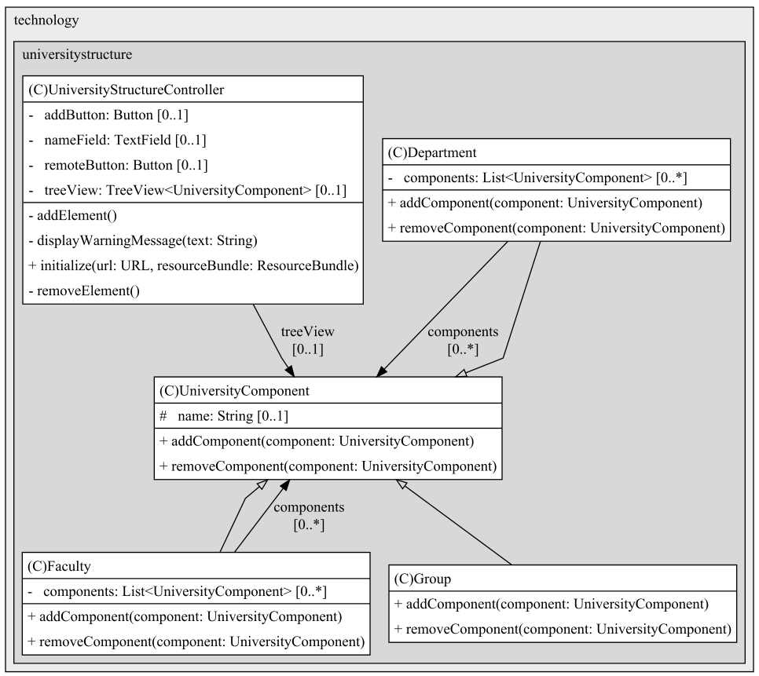
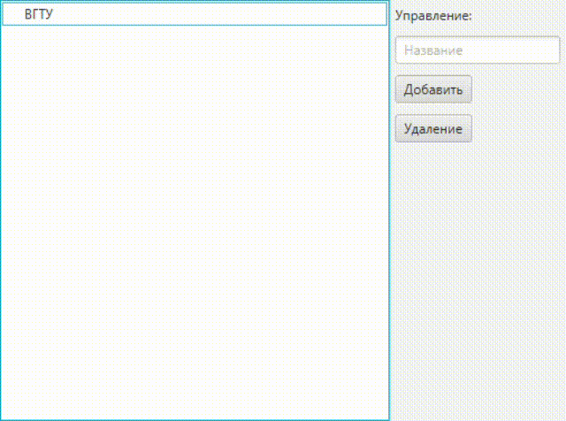

## Task13 | Компоновщик
### Условия задачи
Разработать редактор для построения диаграмм классов. 
В данном случае, в качестве иерархической структуры была выбрана структура университета: 
| Факультет (Контейнер) 
| - Кафедра (Контейнер) 
| - - Учебная группа (Лист) 
### Теоретическая справка
Паттерн Компоновщик — это шаблон проектирования, позволяющий работать с иерархиями различных объектов, как с объектами одного типа.

Паттерн компоновщик описывает, как можно применить рекурсивную композицию таким образом, что клиенту не придется проводить различие между простыми и составными объектами.
### Диаграмма классов

### Результат
