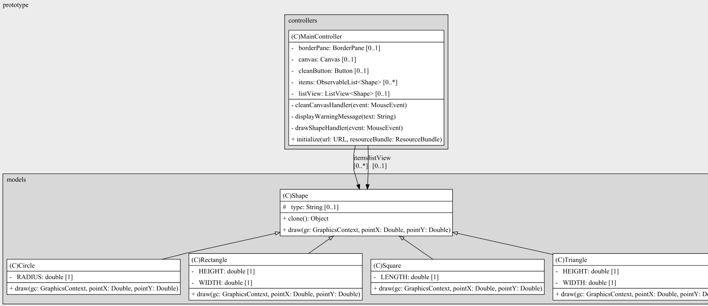
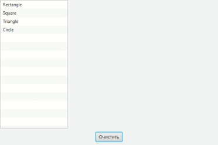

## Task6 | Прототип
### Условия задачи
Требуется написать программу, которая отображает выбранную пользователем фигуру (круг, треугольник, прямоугольник) из списка в произвольном месте окна.
### Теоретическая справка
Паттерн Prototype используется для создания новых объектов на основе прототипа. Прототип - это уже существующий в системе объект, который поддерживает операцию клонирования, то есть умеет создавать копию самого себя. Таким образом, для создания объекта некоторого класса достаточно выполнить операцию clone() соответствующего прототипа.
### Диаграмма классов

### Результат
