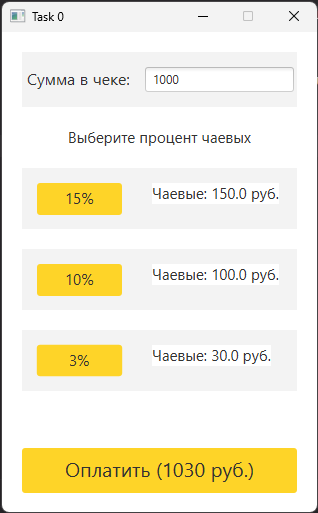

# Task0 | Делегирование
## Условия задачи
Проблема. Получая чек в ресторане, Вы хотите дать "правильные" чаевые в зависимости от Вашего настроения - большие 15%,  обычные 10-9% или "мелочь"  3%

## Теоретическая справка
Наследование - распространенный способ расширения и многократного использования функциональности класса. Делегирование представляет собой более общий подход к решению задачи расширения возможностей поведения класса. Этот подход заключается в том, что некоторый класс вызывает методы другого класса, а не наследует их. Во многих ситуациях, не позволяющих использовать наследование, возможно применение делегирования.

## Результат

